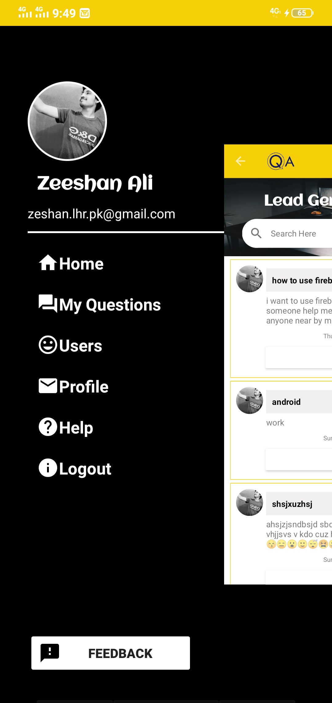

# Q @ A
This is an android app for asking questions related to your subject from the local community. The community will guide you about your problem.
# Tools
<ul>
  <li>Android Studio</li>
  <li> Java</li>
  <li>Firebase</li>
</ul> 

# How to Run
1.Install android studio. 
2.Clone the app repo. 
3.Add your firebase json file to app. 
5. Run App or Build it. 
6. App will work fine. 
# Previews
<b>Some screenshorts of the app</b>  
     &nbsp; &nbsp;
  
&nbsp; &nbsp;

